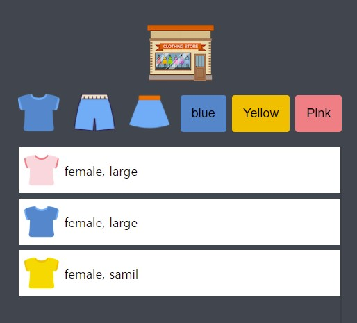

# shopping-game

## 간단한 쇼핑몰 미니게임 만들기

**HTML, CSS, Vanila JS** 

**21.07.04 ~ 21.07.05**

https://00eun.github.io/shopping-game/

---

### 주요 구현 기능

- JSON을 이용한 동적 list 화면 구현
- 버튼을 눌렀을 때 해당 버튼 내용으로 filter하기
- list 스크롤 기능 구현 (overflow-y : scoll)

#### 메인화면 RESULT (all clothes)

#### 메인화면 RESULT (filter by t-shirt)

---

이미지 출처 및 프로젝트 정보 : [드림코딩 엘리](https://academy.dream-coding.com)
